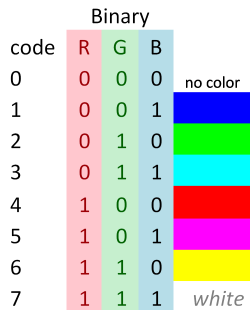

# Pesquisa-Conceitos-de-Imagem

Gustavo da Silva Rezende e Daniel Ryu

## Imagem Digital: Definição.

#### A **Imagem Digital** é a representação de uma imagem bidimensional na forma de números binários usando um conjunto de elementos discretos e de tamanhos finitos, chamados de pixels, colocados em um arranjo bidimensional.

## O que é um pixel?

#### Pixel é a menor unidade de uma imagem digital, independente de sua fonte. Se você pegar uma foto e dar zoom, você verá uma série de quadradinhos que a compõem. Cada um desses pontos luminosos é um pixel. São milhões ou milhares deles. Cada pixel é baseado nas três cores básicas do padrão RGB: vermelho, verde e azul. Monitores convencionais trabalham em uma profundidade de 8 bits. Isso significa que cada uma das três cores básicas possui 256 tonalidades.

## Tipos de Imagens Digitais.

#### Há dois tipos fundamentais de imagem digital. Uma é do tipo rastreio (raster) e outra do tipo vetorial. Uma imagem digital do tipo raster, é aquela que em algum momento apresenta uma correspondência bit-a-bit entre os pontos da imagem raster e os pontos da imagem reproduzida na tela de um monitor. A imagem vetorial não é reproduzida necessariamente por aproximação de pontos, antes era destinada a ser reproduzida por plotters de traçagem que reproduziam a imagem por deslocamento de canetas-tinteiro.

               

## Como funciona as cores na arte digital:

#### A fonte de luz de um monitor ou tela pode criar qualquer cor que você possa imaginar com a combinação de diferentes tonalidades de vermelho, verde e azul. Os nossos olhos são capazes de identificar cerca de 1 milhão de cores que terão suas variações de ondas percebidas pelo cérebro. Entretanto, o que é mais curioso é que essa enorme quantidade tons deriva de apenas 12 classificadas como primárias, secundárias e terciárias. Elas fazem parte do círculo cromático.

## Densidade das Cores através do Bits

#### Pegando um exemplo do modo RGB: o sensor da câmera capta a luz, separa os canais vermelho, verde e azul e traduz a luminância de cada um que chegou até ele para código binário (zeros e uns). É a quantidade de código binário gerado pelo sensor é a que vai determinar a variação de tonalidades que aquele arquivo tem.

